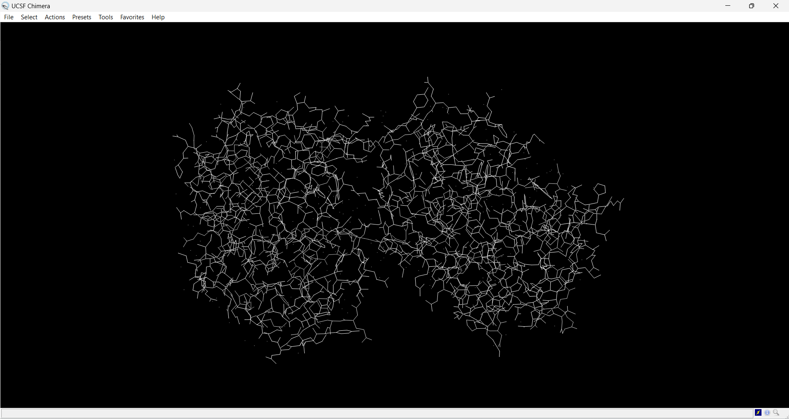
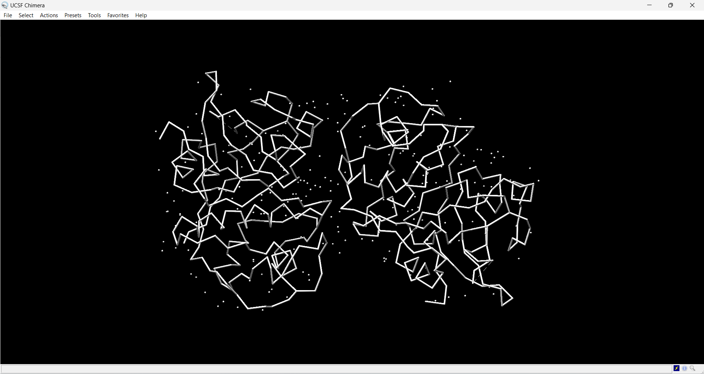
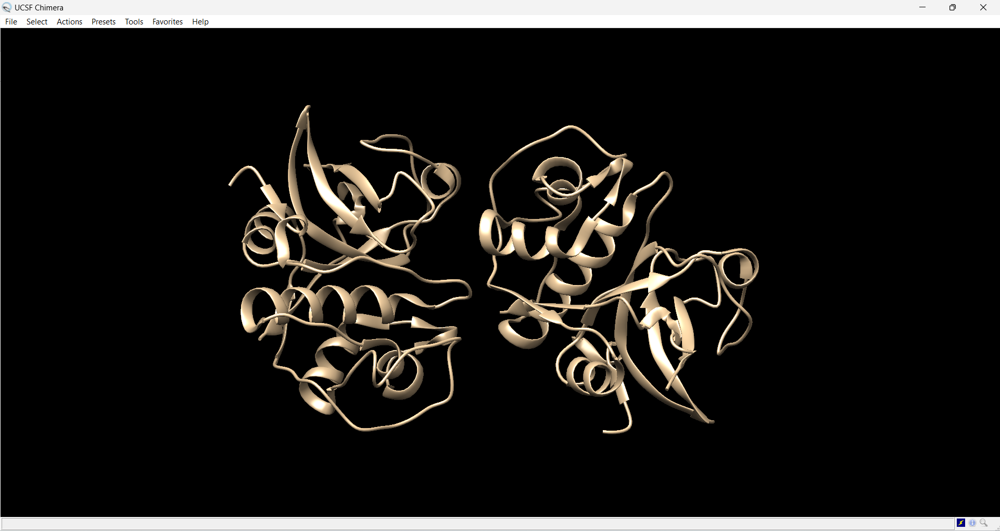
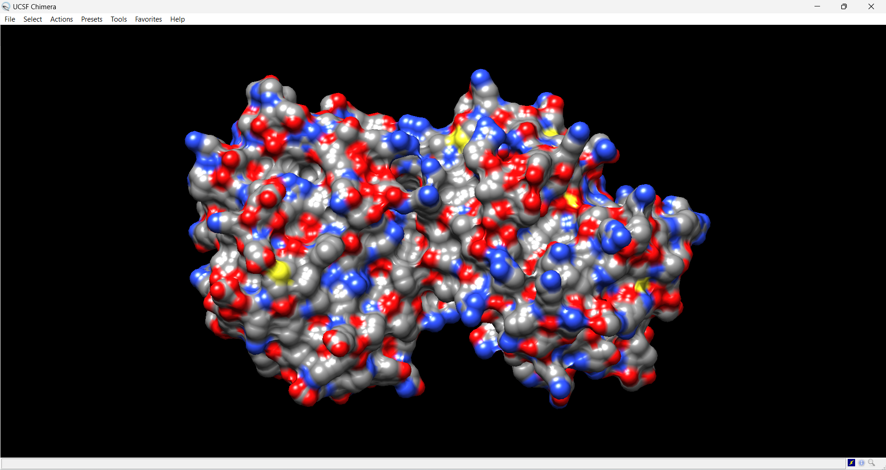
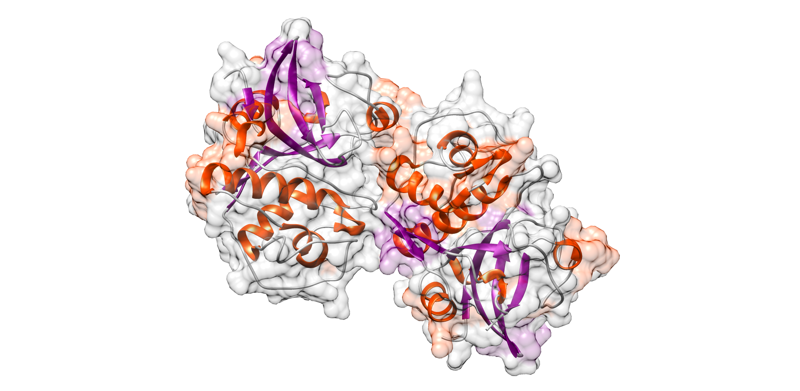

# Визуализация структуры белка

> Использована программа UCSF Chimera и структура белка https://www.rcsb.org/structure/8JCS

## Wireframe

1. Выключить прочие визуализации
2. Перейти в Actions > Atoms/Bonds > wire
3. Включить show в Atoms/Bonds

## Backbone

1. Выключить прочие визуализации
2. Перейти в Actions > Atoms/Bonds > backbone only > minimal
3. Включить show в Atoms/Bonds

## Spacefill

1. Выключить прочие визуализации
2. Перейти в Actions > Atoms/Bonds > sphere
3. Включить show в Atoms/Bonds

## Ribbons

1. Выключить прочие визуализации
2. Перейти в Actions > Ribbon > rounded
3. Включить show в Ribbon

## Molecular surface

1. Выключить прочие визуализации
2. Перейти в Actions > Surface > solid
3. Перейти в Color > by heteroatom
4. Включить show в Surface

---

## Визуализация публикационного качества

1. Actions > Surface > show
2. Actions > Surface > transparency > 80%
3. Presets > Publication 3 (depth-cued, rounded ribbon)
4. Actions > Ribbon > supersmooth
5. Actions > Ribbon > show
6. Tools > Depiction > Color secondary structure > Color ribbons + Color surfaces + All colors
7. File > Save image

