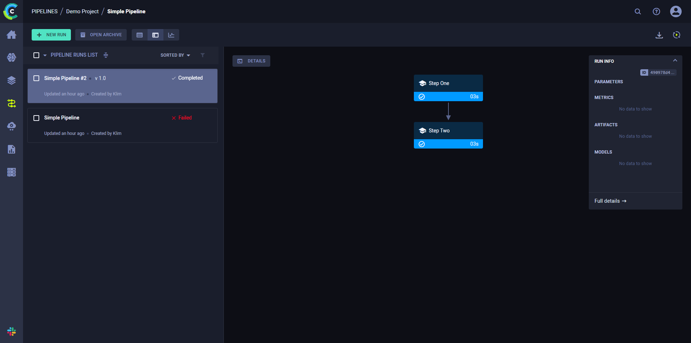
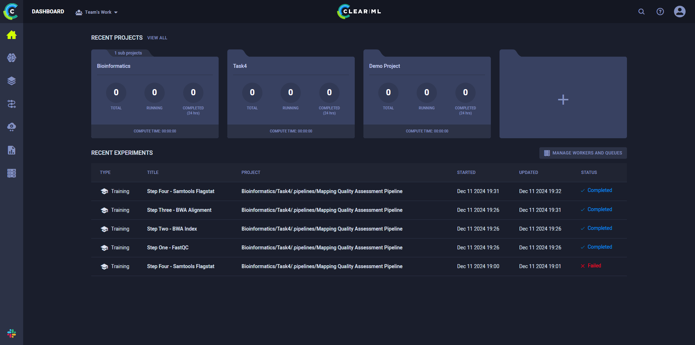
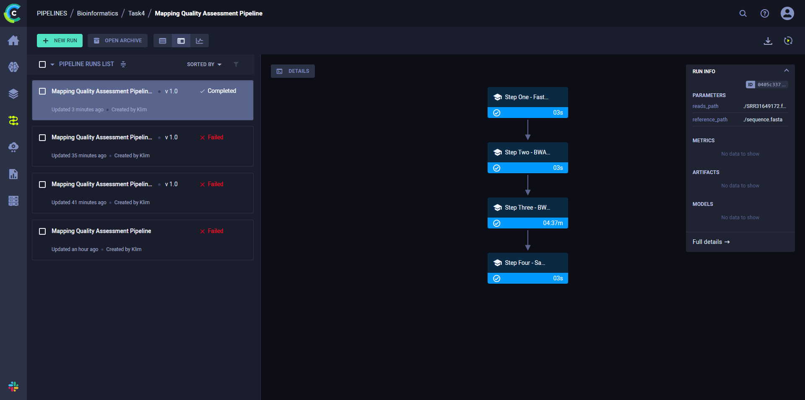

# Построение пайплайна получения генетических вариантов

## Ссылки на загруженные прочтения из NCBI SRA

[Риды](https://trace.ncbi.nlm.nih.gov/Traces/?view=run_browser&acc=SRR31649172&display=metadata)

[Референс](https://www.ncbi.nlm.nih.gov/assembly/GCF_000005845.2/)

## Скрипт на bash с реализованным алгоритмом

[percentor.sh](./percentor.sh)

## Результат команды `samtools flagstat`

```text
2057951 + 0 in total (QC-passed reads + QC-failed reads)
1084964 + 0 primary
0 + 0 secondary
972987 + 0 supplementary
0 + 0 duplicates
0 + 0 primary duplicates
1956396 + 0 mapped (95.07% : N/A)
983409 + 0 primary mapped (90.64% : N/A)
0 + 0 paired in sequencing
0 + 0 read1
0 + 0 read2
0 + 0 properly paired (N/A : N/A)
0 + 0 with itself and mate mapped
0 + 0 singletons (N/A : N/A)
0 + 0 with mate mapped to a different chr
0 + 0 with mate mapped to a different chr (mapQ>=5)
```

## Скрипт разбора файлов с этими результатами

В [percentor.sh](./percentor.sh) есть этап с разбором результатов

```bash
echo "$FLAGSTAT_LOG" | grep -oP 'mapped \(\K[\d.]+(?=%)'
```

## Инструкция по развертыванию и установке фреймворка

Дословно
повторил [инструкцию на официальном сайте](https://clear.ml/docs/latest/docs/deploying_clearml/clearml_server_linux_mac).
Пришлось обновить IP адрес на арендованном сервере, потому что elasticsearch, который входит в сборку заблокировал
российские IP адреса и точечно другие адреса в других странах.

После запуска приложения ClearML нужно сделать

```bash
clearml-init
```

Затем вставить туда ключи, которые можно сгенерировать в админке ClearML, чтобы проинициализировать библиотеку

## Код любого тестового пайплайна (“Hello world”) на фреймворке

[demo-pipeline.py](./demo-pipeline.py)



## Результаты работы пайплайна на фреймворке и лог-файлы

- Лог-файлы: [clearml.log](./clearml.log)
- Результаты работы: [pipeline_results.txt](./pipeline_results.txt)

## *Опционально: описание использованных инструментов для визуального создания пайплайнов (скриншоты)

- Инструмент для визуализации: Веб-сервис ClearML
- Скриншот визуализации:
  

## Код пайплайна “оценки качества картирования” на фреймворке

[percentor.py](./percentor.py)

## Выведенные результаты работы пайплайна на загруженных данных в отдельном файле

- Результаты: [pipeline_results.txt](./pipeline_results.txt)

## Лог-файлы работы пайплайна на загруженных данных

- Лог-файлы: [clearml.log](./clearml.log)

## Визуализация пайплайна в виде графического файла

- Визуализация пайплайна: 

## Описание использованного способа визуализации и отличия полученной визуализации от блок-схемы алгоритма в свободной форме

Описание:

- Использованный способ визуализации: автоматическая визуализация этапов от ClearML
- Отличия от блок-схемы алгоритма: практически идентична блок-схеме в общих чертах, но сильно упрощена. Можно получить
  исходную, если разбить на отдельные этапы
