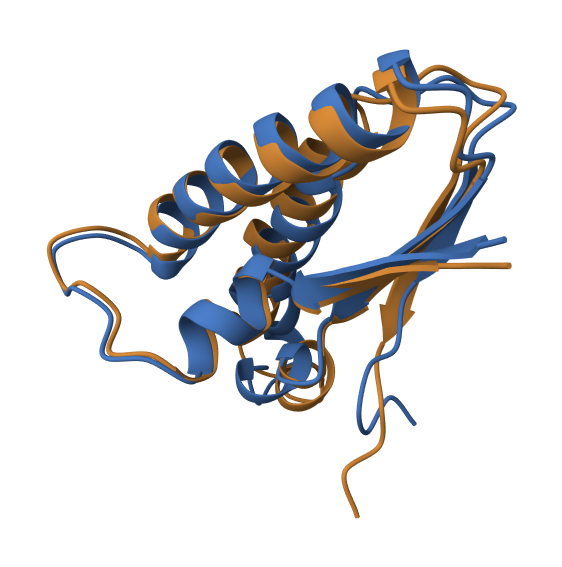

# Предсказание и парное выравнивание структур белков

## Последовательность, используемые программы

- **Последовательность**:
  `MKGMLTGPVTILNWSWPREDITHEEQTKQLALAIRDEVLDLEAAGIKIIQIDEAALREKLPLRKSDWHAKYLDWAIPAFRLVHSAVKPTTQIHTHMCYSE`
- **Программы-предсказатели**: `ESMFold`, `AlphaFold2`
- **Программа для выравнивания**: `jFATCAT-rigid`

## Полученные ноутбуки

- Файлы ноутбуков с предсказаниями структур:
    - [ESMFold.ipynb](./ESMFold.ipynb)
    - [AlphaFold2.ipynb](./AlphaFold2.ipynb)

Посмотрел какие параметры можно настроить, выяснил, что в моём случае последовательность короткая, поэтому обычных
параметров достаточно. Накладывать дополнительные (релаксацию и большее число recycles) не стал

## Предсказания структур в формате PDB

- Полученные структуры:
    - [esmfold-prediction.pdb](./esmfold-prediction.pdb)
    - [alphafold2-prediction.pdb](./alphafold2-prediction.pdb)

## Выдача программы выравнивания

- **Формат mmCIF/другой**:
    - [esmfold-spatial-alignment.pdb.A.cif](./esmfold-spatial-alignment.pdb.A.cif)
    - [alphafold2-spatial-alignment.pdb.A.cif](./alphafold2-spatial-alignment.pdb.A.cif)
- **Логи и файлы**:
    - Выравнивание в виде FASTA (бесполезное достаточно в моём
      случае) [sequence_alignment.fasta](./sequence_alignment.fasta)
    - Матрицы трансформаций для выравнивания [transformation_matrices.json](./transformation_matrices.json)

## Проект/сессия из программы визуализации

- jFATCAT-rigid сделал визуализацию за меня

## Снимки экрана / запись видео

## Выводы о совпадении предсказаний

**RMSD (среднеквадратичное отклонение) = 2.41** — структуры похожи, но есть небольшие различия, особенно в гибких
частях.

**TM-score = 0.82** — высокий уровень сходства, модели почти одинаковы.

**Identity = 100%** — последовательности полностью совпадают.

**Aligned residues = 100** — все остатки совпали при выравнивании.

**Length и Modeled residues = 100** — обе модели полностью покрывают белок.

**Визуальное сравнение** — Альфа-спирали в обеих структурах почти полностью совпадают — они одинаково расположены и
выглядят устойчиво. Бета-листы тоже похожи друг на друга, расхождений почти нет. В петлях есть более значительные
расхождения, потому что они гибкие и сложнее поддаются точному предсказанию. В целом, структуры очень похожи, особенно в
стабильных частях.
