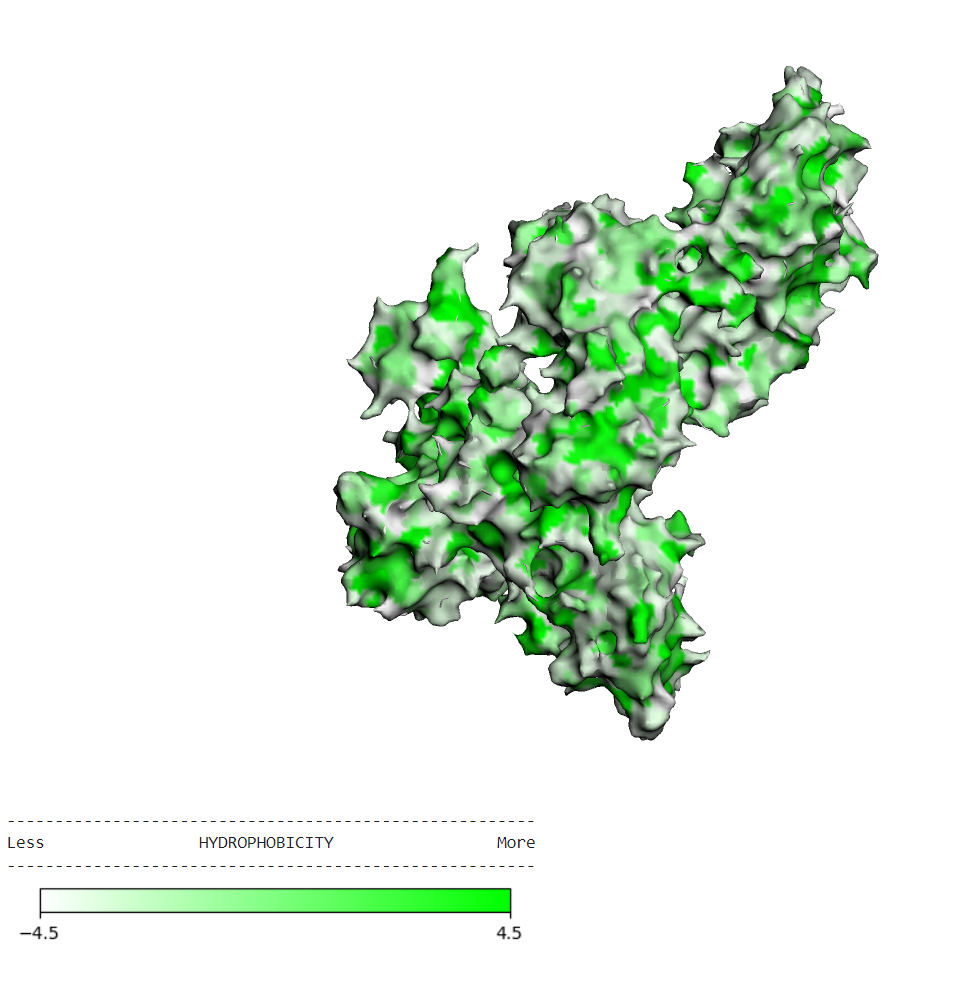
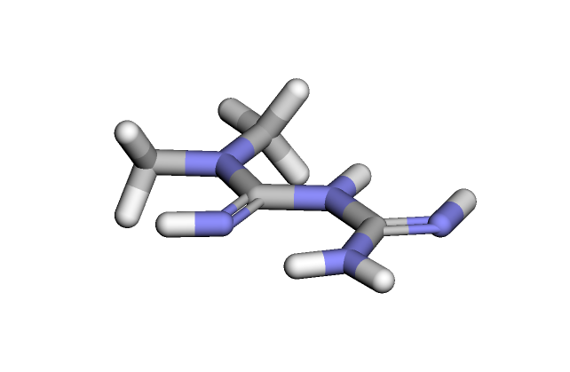
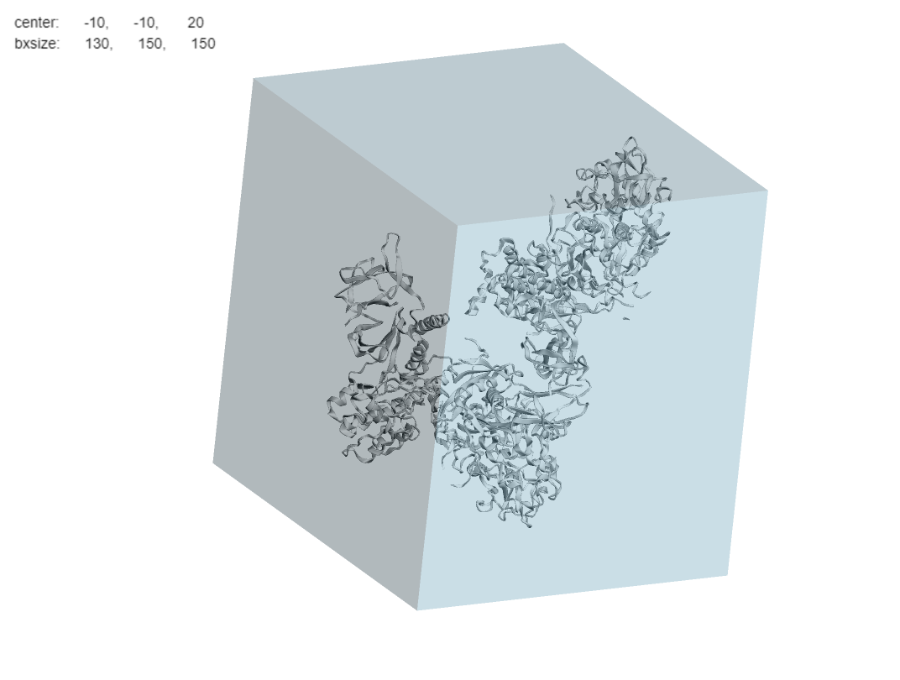
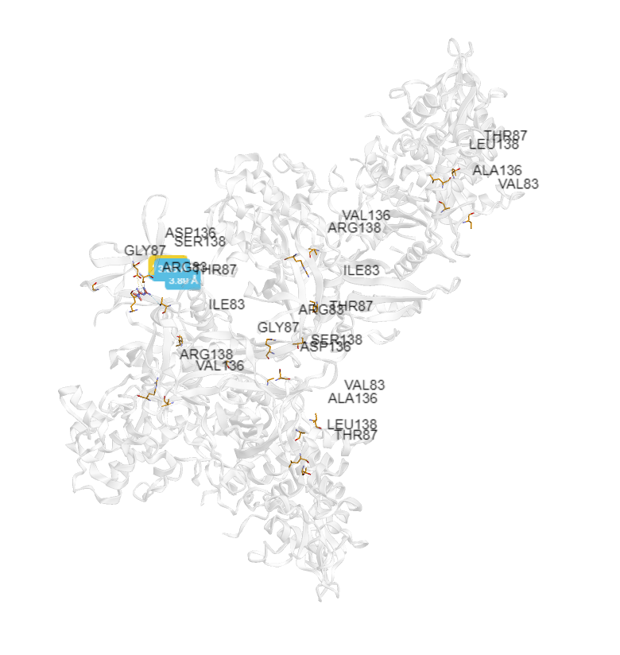
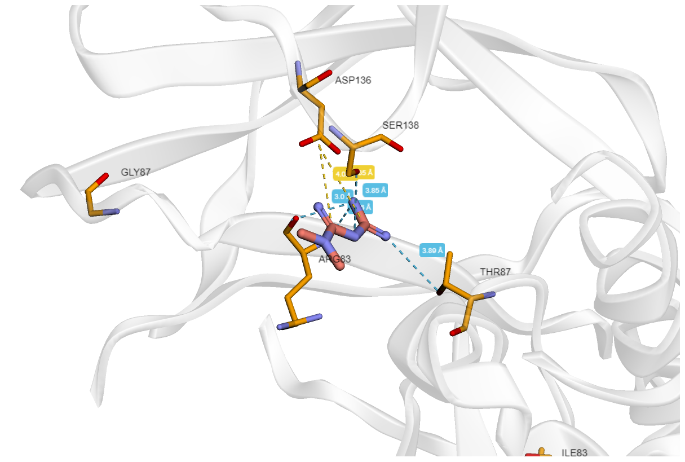

# Докинг лекарственных молекул

## Информация о препарате: Метформин

### a. Действующее вещество

Действующее вещество: **Метформин** (Metformin).

### b. Область применения

Метформин используется для лечения сахарного диабета 2 типа. Он способствует снижению уровня глюкозы в крови, улучшая
чувствительность тканей к инсулину и уменьшая продукцию глюкозы в печени. Метформин также может быть использован для
лечения других состояний, связанных с нарушением углеводного обмена, таких как синдром поликистозных яичников (СПКЯ).

### c. Молекулярный механизм действия

Метформин действует путем активации AMP-активируемой протеинкиназы (AMPK), что приводит к ингибированию синтеза глюкозы
в печени и улучшению утилизации глюкозы в периферических тканях, таких как мышцы. Он не стимулирует выработку инсулина,
что снижает риск гипогликемии, и увеличивает чувствительность клеток организма к инсулину.

## Ноутбук с выполненным докингом

В прикрепленном ноутбуке выполнен процесс молекулярного докинга с использованием AutoDock Vina.

- **Файл ноутбука:** [basic_molecular_docking.ipynb](./basic_molecular_docking.ipynb)

## Результат докинга в формате PDB

Результаты молекулярного докинга, включая конфигурацию лиганда в комплексе с мишенью, в формате PDB.

### Файлы с результатами докинга: 

**Общий результат:** [MF8_1.pdb](./MF8_output.pdbqt)

**Лучшая поза:** [MF8_1.pdb](./MF8_1.pdb)

**Объединение лучшей позы и белка:** [MF8_1_cmpx.pdb](./MF8_1_cmpx.pdb)

Результаты докинга в виде таблицы. Можно увидеть, что поза MF8_1 лучшая, так как у неё самый низкий скор докинга.

| index | NAME   | DOCK\_SC | RMSD\_LB | RMSD\_UB |
|-------|--------|----------|----------|----------|
| 0     | MF8\_1 | -4\.932  | 0\.0     | 0\.0     |
| 1     | MF8\_2 | -4\.89   | 69\.572  | 70\.759  |
| 2     | MF8\_3 | -4\.876  | 80\.121  | 80\.958  |
| 3     | MF8\_4 | -4\.874  | 72\.55   | 73\.484  |
| 4     | MF8\_5 | -4\.749  | 74\.685  | 75\.929  |
| 5     | MF8\_6 | -4\.679  | 37\.302  | 39\.153  |
| 6     | MF8\_7 | -4\.512  | 71\.016  | 71\.954  |
| 7     | MF8\_8 | -4\.511  | 80\.292  | 81\.122  |
| 8     | MF8\_9 | -4\.464  | 2\.537   | 2\.868   |

## 4. Изображения

### a. Трехмерная структура подготовленного таргета

- **Изображение:** 

### b. Трехмерная структура исходного лиганда

- **Изображение:** 

### c. Полученный бокс

- **Изображение:** 

### d. Полученный докинг

- **Изображение:** 

- **Изображение:** 
